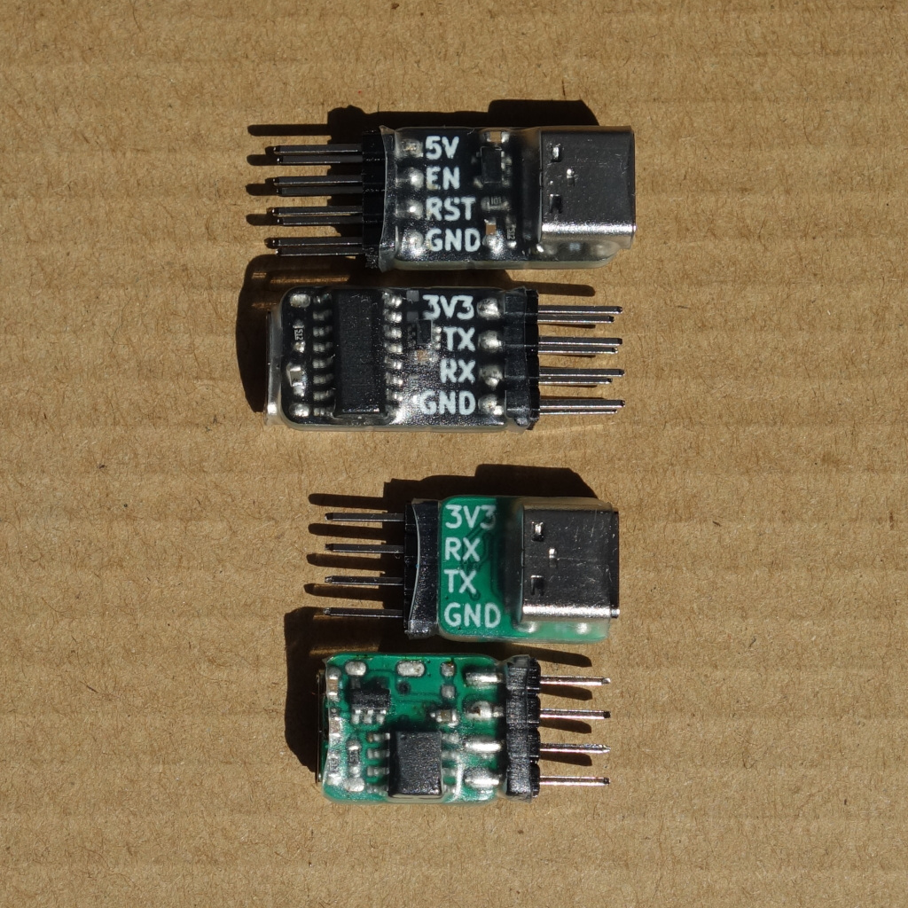

# Tiny USB-C to uart adapters using ch340n / ch340c / ch340b

* Green: simple 3v3 rx/tx (CH340N chip)
* Black: 3v3 rx/tx & reset circuit compatible with esptool (CH340C chip)
* Both: AP2112K-3.3 LDO

